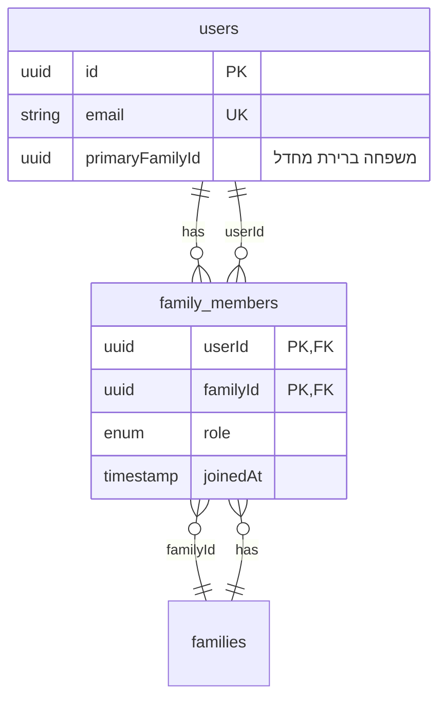
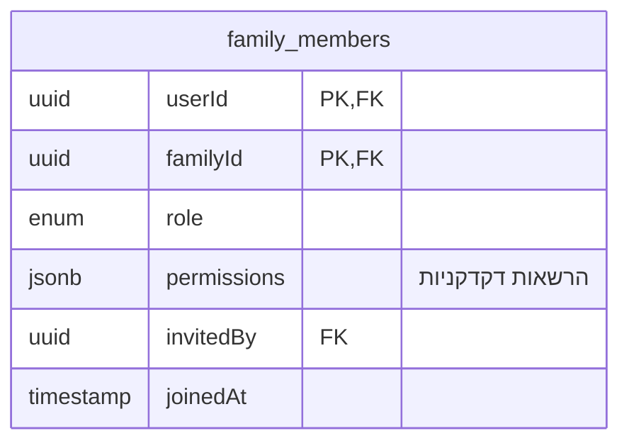

# תמיכה במשתמש במספר משפחות

## המצב הנוכחי

- **User** שייך ל-**משפחה אחת** בלבד (`users.familyId`)
- אותה כתובת אימייל יכולה להופיע רק במשתמש אחד (unique)
- במצב join – נוצר משתמש חדש עם אותו familyId של המשפחה שאליה מצטרפים
- אין אפשרות למשתמש קיים להצטרף למשפחה שנייה

---

## הפתרון המוצע: טבלת Many-to-Many

### מודל נתונים חדש




**רעיון:**  

- `users.familyId` → `users.primary_family_id` (אופציונלי) – משפחת ברירת מחדל  
- טבלה חדשה `family_members`: `(user_id, family_id, role, permissions, joined_at)`  
- כל משתמש יכול להיות חבר במספר משפחות  
- **הרשאות נקבעות לכל שיוך משפחתי בנפרד** (היררכיה)

---

## הרשאות לכל משפחה (היררכיה)

הרשאות הן **לכל התא המשפחתי**, לא גלובליות. אותו משתמש יכול:

- **משפחת אבא שלו** – גישה מלאה: פיננסי, ביטוחים, תרופות, משימות וכו'
- **משפחת אבא של אישתו** – גישה מוגבלת: רק משימות/תזכורות, בלי פיננסי וביטוחים

### מודל הרשאות

**Role** (ברמת התא המשפחתי): `manager` | `caregiver` | `viewer` | `guest`  
**Permissions** (מטריצת הרשאות דקדקנית, לפי התא המשפחתי):


| הרשאה            | תיאור                            |
| ---------------- | -------------------------------- |
| `view_patient`   | צפייה בפרופיל מטופל              |
| `edit_patient`   | עריכת פרופיל מטופל               |
| `view_tasks`     | צפייה במשימות                    |
| `edit_tasks`     | יצירה/עדכון משימות               |
| `view_financial` | צפייה בעניינים פיננסיים          |
| `edit_financial` | עריכת פיננסי                     |
| `view_insurance` | צפייה בביטוחים                   |
| `edit_insurance` | עריכת ביטוחים                    |
| `view_documents` | צפייה במסמכים                    |
| `manage_members` | ניהול חברי משפחה (invite, roles) |


הגדרת ההרשאות מתבצעת **בהקמת התא המשפחתי** או בהצטרפות – למשל:

- Manager קובע הרשאות בעת הזמנה
- אפשרות לקבוע preset לפי role (manager = הכל, caregiver = בלי פיננסי, viewer = צפייה בלבד)

### עדכון המודל




- `permissions`: אובייקט `{ view_patient, edit_patient, view_financial, ... }` או array של strings  
- כל endpoint שמציג נתונים רגישים (פיננסי, ביטוחים) בודק את `permissions` עבור `familyId` הפעיל

---

## Backend

### 1. Migration – Schema

**קובץ:** `server/db/migrations/XXXX_multi_family.sql`

- יצירת טבלה `family_members` עם `(user_id, family_id, role, joined_at)` ומפתח מורכב `(user_id, family_id)`
- מילוי `family_members` מ-`users.family_id` הקיים
- הוספת עמודה `primary_family_id` ל-`users` (אופציונלי)
- עדכון `users.primary_family_id` לפי `users.family_id`
- (אופציונלי) הסרת `family_id` מ-`users` לאחר מעבר מלא

### 2. Helpers – גישה והרשאות למשפחה

```ts
// בדיקת חברות במשפחה
async function userHasAccessToFamily(userId: string, familyId: string): Promise<boolean> { ... }

// החזרת membership כולל הרשאות (לבדיקות דקדקניות)
async function getMembership(userId: string, familyId: string): Promise<{ role, permissions } | null> { ... }

// בדיקת הרשאה ספציפית (למשל פיננסי, ביטוחים)
function hasPermission(membership: Membership, perm: string): boolean {
  if (membership.role === 'manager') return true; // manager = הכל
  return membership.permissions?.includes(perm) ?? false;
}
```

כל endpoint שמחזיר נתונים רגישים (פיננסי, ביטוחים, מסמכים) יקרא ל-`getMembership` ויבדוק `hasPermission` לפני החזרת הנתונים.

### 3. Endpoints חדשים


| Endpoint                 | תיאור                                                   |
| ------------------------ | ------------------------------------------------------- |
| `GET /users/me/families` | רשימת משפחות שהמשתמש חבר בהן                            |
| `POST /families/join`    | הצטרפות למשפחה קיימת באמצעות `inviteCode` (משתמש מחובר) |
| `PATCH /users/me`        | עדכון `primaryFamilyId` – משפחת ברירת מחדל              |


### 4. עדכון Endpoints קיימים

- `**GET /auth/me**` – החזרת `families: Array<{id, name, role, permissions}>` + `primaryFamilyId`
- **כל הנתיבים התלויים במשפחה** – קבלת `familyId` כ-query param או header (למשל `X-Active-Family`), ובדיקה דרך `userHasAccessToFamily`
- רלוונטי ל: `/patients`, `/tasks`, `/notifications` וכו'

### 5. לוגיקת Join למשפחה שנייה

- משתמש מחובר קורא ל-`POST /families/join` עם `{ inviteCode }`
- **קוד ההזמנה יכול להיות מקושר ל-preset של הרשאות** (למשל "קוד viewer" / "קוד caregiver עם פיננסי")
- או: Manager יוצר קוד הזמנה ובוחר role + permissions עבור המצטרפים
- הוספת שורה ל-`family_members` עם role + permissions
- החזרת המשפחה החדשה ברשימת המשפחות

### 6. יצירת קודי הזמנה עם הרשאות

- טבלה `family_invites` (אופציונלי): `(family_id, code, role, permissions, expires_at)`  
או הרשאות מגיעות מה-preset של הקוד (למשל כל קוד MEM-XXXX מגדיר role מסוים)
- Manager יוצר קוד ומגדיר: role + אילו permissions (פיננסי, ביטוחים וכו')

---

## Frontend

### 1. מצב (State)

- `AuthUser`: `families: { id, name, role }[]`, `primaryFamilyId: string`
- `activeFamilyId` – המשפחה שנבחרה כרגע (מקור: `primaryFamilyId` או בחירה ידנית)
- שמירה של `activeFamilyId` ב-`localStorage` (למשל `memoraid_active_family`)

### 2. Family Switcher

- בסטריפ העליון (ליד "מחובר" / בלוק המשפחה): בחירת משפחה פעילה מתוך רשימת המשפחות
- כשיש משפחה אחת – מציג רק את שמה
- כשיש יותר ממשפחה אחת – dropdown לבחירת משפחה, עדכון `activeFamilyId` ושימוש בו בכל הבקשות

### 3. שליחת המשפחה הפעילה ל-API

- הוספת header לכל בקשה: `X-Active-Family: <familyId>`
- או query param לכל קריאה רלוונטית: `?familyId=<id>`

### 4. עדכון hooks ו-components

- [client/src/hooks/useAuth.ts](client/src/hooks/useAuth.ts) – הרחבת `AuthUser` והחזרת `families: { id, name, role, permissions }[]` + `primaryFamilyId`
- [client/src/App.tsx](client/src/App.tsx) – Family switcher בסטריפ
- Context/state עבור `activeFamilyId`
- כל קריאות ה-API שמשתמשות ב-`familyId` – שימוש ב-`activeFamilyId`

### 5. הרשאות ב-UI (לפי המשפחה הפעילה)

- הסתרת/הצגת אזורים לפי `permissions` של המשפחה הפעילה:
  - ללא `view_financial` – הסתרת טאב/סקשן פיננסי
  - ללא `view_insurance` – הסתרת ביטוחים
  - ללא `edit_patient` – כפתורי עריכה מושבתים
- שימוש ב-hook או context: `useActiveFamilyPermissions()` → `{ canViewFinancial, canEditPatient, ... }`

### 6. Join משפחה נוספת

- דף "הגדרות" / "משפחות" – שדה להזנת קוד הזמנה
- כפתור "הצטרף למשפחה"
- קריאה ל-`POST /families/join`
- עדכון `families` אצל המשתמש ובממשק

---

## סדר ביצוע מומלץ

1. Migration + סכמה (כולל `family_members` עם `role` + `permissions`)
2. Backend: helpers (`userHasAccessToFamily`, `getMembership`, `hasPermission`) + `GET /users/me/families`, `POST /families/join`
3. Backend: עדכון `auth/me` (החזרת families + permissions) וכל הנתיבים התלויים במשפחה
4. Backend: בדיקת הרשאות ב-endpoints רגישים (פיננסי, ביטוחים) לפי `hasPermission`
5. Frontend: הרחבת `AuthUser` + `activeFamilyId` + Family switcher
6. Frontend: `useActiveFamilyPermissions()` + הסתרת/הצגת UI לפי הרשאות
7. Frontend: Join משפחה נוספת
8. הגדרת קודי הזמנה עם preset הרשאות (אם נדרש)

---

## שאלות פתוחות

1. **users.familyId** – לשמור כ-`primaryFamilyId` לצורך תאימות לאחור, או מעבר מלא ל-`family_members` בלבד?
2. **Notifications** – לכל משפחה התראות נפרדות, או ריכוז לפי משתמש?
3. **Preset הרשאות** – האם קודי ההזמנה יוגדרו מראש (למשל "קוד viewer" / "קוד caregiver") או שכל manager מגדיר הרשאות ידנית לכל הזמנה?

