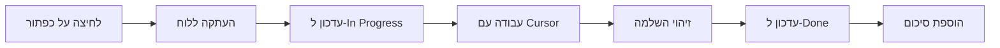

# תכנית אינטגרציה: Kanban ↔️ Cursor AI

## 🎯 החזון

מערכת ניהול פיתוח משולבת עם AI שמאפשרת:
1. לחיצה על כפתור במשימה = התחלת עבודה עם Cursor AI
2. עדכון אוטומטי של סטטוס המשימה
3. סנכרון דו-כיווני בין הקנבאן ל-AI
4. ניהול ספרינטים בסגנון JIRA

## 📋 Phase 1: כפתור "עבוד עם AI"

### תכונות:
- [x] כפתור בכל כרטיס משימה
- [ ] העתקה אוטומטית ללוח
- [ ] עדכון סטטוס ל-"In Progress"
- [ ] פורמט מובנה למשימה

### דוגמה לפורמט:
```
🎯 משימה מהקנבאן: Google Calendar Integration

תיאור:
Implement OAuth2 flow for Google Calendar API
- Create credentials in Google Cloud Console
- Add OAuth2 callback endpoint
- Store refresh tokens securely
- Sync tasks to calendar

קטגוריה: calendar
עדיפות: 🔴 High
הערכה: 8 שעות
תאריך יעד: 2026-03-01

תגיות: #oauth #google #calendar #integration

בואו נתחיל לעבוד!
```

## 📋 Phase 2: עדכון אוטומטי

### תכונות:
- [ ] Webhook/Polling לזיהוי התקדמות
- [ ] עדכון אוטומטי מ-"In Progress" ל-"Done"
- [ ] הוספת תגובה אוטומטית עם סיכום
- [ ] קישור לקבצים שנוצרו

### Flow:


## 📋 Phase 3: ספרינטים (JIRA-style)

### מבנה:
```typescript
type Sprint = {
  id: string;
  name: string;
  startDate: Date;
  endDate: Date;
  goal: string;
  tasks: DevTask[];
  status: 'planning' | 'active' | 'completed';
};
```

### תכונות:
- [ ] יצירת ספרינט חדש
- [ ] הוספת משימות לספרינט
- [ ] Burndown chart
- [ ] Sprint velocity
- [ ] Sprint retrospective

### UI:
```
┌─────────────────────────────────────────┐
│ Sprint 12: Calendar Integration         │
│ 20.02.2026 - 05.03.2026 (14 ימים)      │
│                                         │
│ Goal: Complete Google & Outlook sync   │
│                                         │
│ Progress: ████████░░░░░░░░ 45%         │
│                                         │
│ 📊 5/11 משימות הושלמו                  │
│ ⏱️  32/80 שעות נוצלו                   │
│ 🎯 Velocity: 3.5 points/day            │
│                                         │
│ [+ הוסף משימה] [סיים ספרינט]          │
└─────────────────────────────────────────┘
```

## 📋 Phase 4: תכנית עבודה (Work Plan)

### שילוב עם AdminWorkPlan.tsx:
- [ ] הצגת ספרינטים פעילים
- [ ] Timeline ויזואלי
- [ ] Dependencies בין משימות
- [ ] Critical path
- [ ] Resource allocation

### Gantt Chart:
```
Task 1  ████████░░░░░░░░░░░░
Task 2      ████████░░░░░░░░
Task 3          ████████████
Task 4              ████████
        ├────┼────┼────┼────┤
       W1   W2   W3   W4   W5
```

## 🔗 Phase 5: אינטגרציה עמוקה עם Cursor

### אפשרויות טכניות:

#### Option A: Clipboard API (קל ומהיר)
```typescript
async function sendToCursor(task: DevTask) {
  const prompt = formatTaskPrompt(task);
  await navigator.clipboard.writeText(prompt);
  
  // עדכון סטטוס
  await updateTask(task.id, { 
    status: 'in_progress',
    startedAt: new Date() 
  });
  
  // הצגת הודעה
  showToast('המשימה הועתקה! הדבק בצ'אט Cursor');
}
```

#### Option B: Cursor Extension (מתקדם)
```typescript
// Cursor extension API (אם קיים)
cursor.tasks.create({
  title: task.title,
  description: task.description,
  context: {
    files: task.relatedFiles,
    priority: task.priority,
    category: task.category,
  },
  onComplete: async () => {
    await updateTask(task.id, { status: 'done' });
  },
});
```

#### Option C: Custom Protocol (מאוד מתקדם)
```typescript
// cursor://task?id=123&action=start
window.location.href = `cursor://task?id=${task.id}&action=start`;
```

## 🎨 UI Components חדשים

### 1. TaskActionButton.tsx
```tsx
<button 
  onClick={() => startWorkingWithAI(task)}
  className="flex items-center gap-2 px-3 py-1.5 rounded-lg bg-gradient-to-r from-purple-600 to-blue-600 hover:from-purple-500 hover:to-blue-500 text-white"
>
  <Sparkles className="w-4 h-4" />
  עבוד עם AI
</button>
```

### 2. SprintBoard.tsx
```tsx
<div className="sprint-board">
  <SprintHeader sprint={activeSprint} />
  <SprintProgress tasks={sprintTasks} />
  <SprintKanban tasks={sprintTasks} />
  <SprintMetrics sprint={activeSprint} />
</div>
```

### 3. WorkPlanTimeline.tsx
```tsx
<div className="timeline">
  {sprints.map(sprint => (
    <SprintBar 
      sprint={sprint}
      tasks={sprint.tasks}
      onTaskClick={sendToCursor}
    />
  ))}
</div>
```

## 📊 Database Schema - Sprints

```sql
CREATE TABLE sprints (
  id uuid PRIMARY KEY,
  name varchar(255) NOT NULL,
  goal text,
  start_date timestamp NOT NULL,
  end_date timestamp NOT NULL,
  status varchar(32) DEFAULT 'planning',
  velocity decimal,
  created_at timestamp DEFAULT now()
);

CREATE TABLE sprint_tasks (
  sprint_id uuid REFERENCES sprints(id),
  task_id uuid REFERENCES dev_tasks(id),
  story_points integer,
  PRIMARY KEY (sprint_id, task_id)
);

CREATE TABLE sprint_activities (
  id uuid PRIMARY KEY,
  sprint_id uuid REFERENCES sprints(id),
  activity_type varchar(64),
  description text,
  created_at timestamp DEFAULT now()
);
```

## 🚀 Implementation Plan

### Week 1: Basic Integration
- [ ] כפתור "עבוד עם AI" בכרטיס
- [ ] פורמט מובנה למשימה
- [ ] העתקה אוטומטית ללוח
- [ ] עדכון סטטוס ל-In Progress

### Week 2: Sprint Management
- [ ] טבלאות Sprints במסד נתונים
- [ ] UI ליצירת ספרינט
- [ ] הוספת משימות לספרינט
- [ ] Sprint board view

### Week 3: Work Plan Integration
- [ ] Timeline ויזואלי
- [ ] Gantt chart
- [ ] Dependencies
- [ ] Critical path

### Week 4: Advanced Features
- [ ] Burndown chart
- [ ] Velocity tracking
- [ ] Sprint retrospective
- [ ] Auto-completion detection

## 💡 רעיונות נוספים

### 1. AI Task Suggestions
```typescript
// AI מציע משימות על בסיס ההיסטוריה
const suggestions = await ai.suggestTasks({
  category: 'calendar',
  context: completedTasks,
  sprint: activeSprint,
});
```

### 2. Smart Estimates
```typescript
// הערכת זמן אוטומטית על בסיס משימות דומות
const estimate = await ai.estimateTask({
  title: task.title,
  description: task.description,
  similarTasks: findSimilarTasks(task),
});
```

### 3. Code Review Integration
```typescript
// קישור ל-PR ב-GitHub
task.pullRequest = {
  url: 'https://github.com/...',
  status: 'open',
  reviews: 2,
  checks: 'passing',
};
```

### 4. Time Tracking
```typescript
// מעקב אחר זמן עבודה אמיתי
task.timeEntries = [
  { date: '2026-02-20', hours: 3.5, note: 'OAuth implementation' },
  { date: '2026-02-21', hours: 4.0, note: 'Testing & debugging' },
];
```

## 🎯 Success Metrics

### KPIs:
- ⏱️ זמן ממוצע להשלמת משימה
- 📊 Velocity per sprint
- ✅ Task completion rate
- 🎯 Sprint goal achievement
- 🤖 AI collaboration rate (% משימות שנעשו עם AI)

### Dashboard:
```
┌────────────────────────────────────────┐
│ 📊 Development Metrics                 │
├────────────────────────────────────────┤
│ Sprint Velocity:      12.5 points/week │
│ Avg Task Time:        6.2 hours        │
│ Completion Rate:      87%              │
│ AI Collaboration:     65%              │
│ Code Quality:         ⭐⭐⭐⭐⭐         │
└────────────────────────────────────────┘
```

## 🔐 Security & Privacy

- [ ] הצפנת tokens
- [ ] Audit log לכל פעולה
- [ ] הרשאות לפי תפקיד
- [ ] Backup אוטומטי

## 📝 Documentation

- [ ] API documentation
- [ ] User guide
- [ ] Video tutorials
- [ ] Best practices

## 🎉 סיכום

זה יכול להפוך את MemorAid למערכת הניהול הכי מתקדמת שיש!

**הרעיון שלך של שילוב עם Cursor AI הוא גאוני! 🚀**

נתחיל עם Phase 1 (כפתור "עבוד עם AI") ונבנה משם הלאה?
