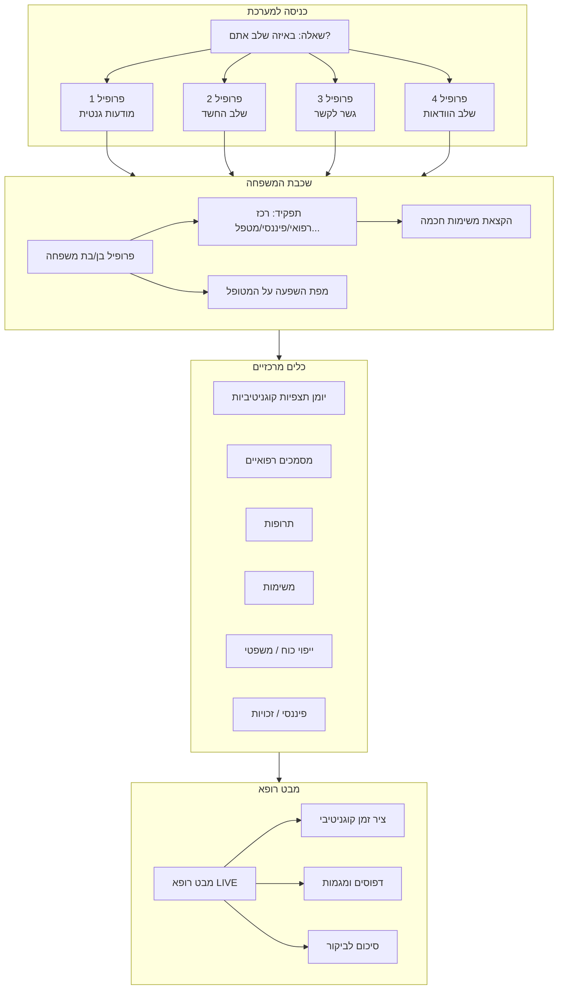

# MEMORAID — ראיית העולם המלאה
## מסמך אסטרטגי ופיתוח מקיף

---

> **"MEMORAID לא בנויה לרופאים. היא בנויה למשפחה שמרגישה לבד עם הכאב הזה, ולא יודעת מה לעשות הלאה."**

---

## חלק א׳ — הבנת הבעיה האמיתית

### מה שמשפחות חוות ברגשות — ולא במערכות

כשסבתא של יואב אובחנה עם אלצהיימר לפני 15 שנה, אף אחד לא אמר לאף אחד שאולי כדאי לבדוק גם את אביו. אף אחד לא תיעד את הסיכון המשפחתי. אף מערכת לא חיברה בין הסבתא לאבא.

כשאחד מהילדים שם לב שאבא חוזר על עצמו שלוש פעמים בשיחה — אין לו כלי לתעד את זה בצורה שתועיל לרופא. הוא מספר לאחיו בוואטסאפ, זה הולך לאיבוד.

כשהמשפחה מגיעה לנוירולוג לראשונה אחרי חצי שנה של בלבול, אין להם תיעוד של מה שקרה. "הוא קצת שכחן" — זה לא נתון, זה רגש.

**זאת הבעיה שMEMORAID פותרת.**

---

## חלק ב׳ — ארבעת הפרופילים: קונספט הליבה של MEMORAID

המסע של המשפחה עם מחלת הדמנציה מתחיל הרבה לפני האבחנה. לכן כשמשפחה נרשמת ל-MEMORAID, השאלה הראשונה אינה "מה שם המטופל?" אלא:

**"באיזה שלב אתם?"**

```
genetic_awareness → suspicion → bridge → certainty
מודעות גנטית     → שלב החשד → גשר לקשר → שלב הוודאות
```

### פרופיל 1 — מודעות גנטית (Genetic Awareness)

**הטריגר:** "לסבתא שלי היה אלצהיימר. לאבא שלי יש גם סוכרת. חושש ממה שיבוא."

**מצב המטופל:** תקין לחלוטין. עדיין אין כלום. אולי לא יהיה כלום. אולי כן.

**מה המשפחה צריכה עכשיו:**
- חינוך: מה הם גורמי הסיכון? מה ניתן לעשות מניעתית?
- תיעוד היסטוריה רפואית משפחתית (שתעזור לרופא בעתיד)
- הכנה משפטית: ייפוי כוח נוטריוני — **לעשות עכשיו, לפני שיהיה מאוחר**
- הכנה פיננסית: ביטוחים, נכסים, חשבונות
- הערכה קוגניטיבית בסיסית (Baseline) — כדי שיהיה נקודת השוואה עתידית
- "מה לצפות" — מדריך לבני משפחה

**מה המערכת מספקת:**
- לוח מחוונים עם רשימות תיוג לפי קטגוריה: רפואי, משפטי, פיננסי
- ספרייה חינוכית: "הבנת גורמי הסיכון", "שיחת הכנה עם ההורה"
- קישור לייעוץ גנטי, עורך דין, יועץ פיננסי
- הנחיה: "שוחח עם רופא המשפחה על ההיסטוריה המשפחתית"

---

### פרופיל 2 — שלב החשד (Suspicion)

**הטריגר:** "אבא חוזר על עצמו. שכח את יום ההולדת שלי לראשונה בחיים. משהו השתנה."

**מצב המטופל:** לא שינה, לא אובחן. אבל המשפחה מרגישה שמשהו לא בסדר.

**הקושי הייחודי בשלב הזה:**
- **סטיגמה**: "אולי אני מגזים? אולי זה סתם גיל?"
- **הכחשה**: "אבא ישמע ויכעס. לא רוצה לפגוע בו."
- **חוסר ידע**: "לאיזה רופא הולכים עם זה? מה אומרים?"
- **פחד**: "ומה אם זה באמת משהו?"

**מה המשפחה צריכה עכשיו:**
- כלי תיעוד — לרשום **בדיוק** מה קרה, מתי, באיזה הקשר
- אימות: "האם מה שאני רואה הוא סימן אזהרה?"
- הנחיה: "איך מדברים עם רופא המשפחה על זה?"
- תמיכה רגשית: "אתם לא לבד בזה"

**כאן נכנס יומן התצפיות (דף הזכרונות המעוצב מחדש):**
זה לא "רגעים יפים". זה **עדות קלינית משפחתית**. כל רשומה היא נקודת מידע לרופא.

---

### פרופיל 3 — גשר לקשר (Bridge)

**הטריגר:** "הנוירולוג אמר לבוא לבדיקות. קבענו MRI. יש המתנה של חודשיים."

**מצב המטופל:** תחת בירור. עדיין אין אבחנה, אבל כולם יודעים שמשהו קורה.

**הכאוס האמיתי בשלב הזה:**
- תורים רפואיים מרובים בבתי חולים שונים
- כל רופא רוצה תיאור שונה של המצב
- המשפחה מתחלקת בדעות: "לעשות כל בדיקה" vs "לא להעמיס עליו"
- **ייפוי כוח — חלון הזדמנויות שנסגר**: אם עדיין לא נעשה — לעשות **עכשיו**, כי בקרוב אולי לא ניתן
- החלטות כלכליות שצריך לקבל לפני האבחנה

**מה המערכת מספקת:**
- ניהול תורים ובדיקות (לכל מי שאחראי)
- "שאלות שחובה לשאול את הנוירולוג" — רשימה מוכנה
- לוח ייפוי כוח: סטטוס — האם נחתם? אצל מי?
- הכנת "תיק רפואי לביקור": סיכום לרופא כולל תצפיות המשפחה

---

### פרופיל 4 — שלב הוודאות (Certainty)

**הטריגר:** "האבחנה חזרה חיובית. אלצהיימר שלב ראשון."

**מצב המטופל:** מאובחן. מנהלים חיים עם המחלה.

**מה משתנה:**
הטיפול עובר **ממשבר לשגרה**. האתגר כבר לא "מה קורה?" אלא "איך ממשיכים?"

**מה המשפחה צריכה:**
- ניהול תרופות יומי
- שמירה על שגרה (הרבה יותר קריטי ממה שחושבים)
- בטיחות בבית: שינויים נדרשים
- מיצוי זכויות: קצבאות, שירותי קהילה, ביטוח סיעודי
- תמיכה במטפלים: שחיקת המטפל היא האיום הכי גדול
- תכנון עתידי: גיל הזהב, דיור מוגן, בית אבות
- תיעוד מתמשך לרופאים (ציר הזמן הקוגניטיבי ממשיך)

---

## חלק ג׳ — שכבת אינטליגנציה משפחתית

### הרעיון הגדול: לא "משפחה" — אנשים

MEMORAID לא מתייחסת ל"משפחה" כישות אחת. **כל בן משפחה הוא דמות שונה עם תפקיד שונה, יכולות שונות, ומערכת יחסים שונה עם המטופל.**

### פרופיל בן/בת משפחה

כל חבר משפחה מוגדר ב:

- **קרבה רגשית למטופל** — מי הכי קרוב, מי שומע הכי טוב
- **קרבה גיאוגרפית** — מי גר קרוב, מי יכול להגיע בדחיפות
- **יכולות/מומחיות**: פיננסי, רפואי, משפטי, לוגיסטי, תמיכה רגשית
- **זמינות**: שעות, ימים, מחויבויות אחרות
- **סוג השפעה** — המטופל מקשיב לו על מה? בתחום פיננסי? רגשי? בריאותי?

### מפת השפעה (Influence Map)

זה הקונספט הכי ייחודי ב-MEMORAID:

לא רק מי עושה מה — אלא **מי יכול להגיע למטופל בנושא ספציפי**.

```
יואב (בן)         → המטופל פותח איתו על בריאות ורגשות
                   → מינוי: שיחות עם רופאים, ביקורים בתור
                   
מיכאל (בן)        → המטופל סומך עליו בכסף
                   → מינוי: ניהול חשבונות, ביטוחים, ייפוי כוח פיננסי

שרה (בת)          → המטופל שומע לה בנושאי יומיום
                   → מינוי: הערכת בטיחות בבית, שיחה על דיור מוגן

מרים (כלה)        → רואה אותו כל שבוע, קשר שגרתי
                   → מינוי: מעקב יומי, תרופות, ארוחות
```

### תפקידים רשמיים (Roles)

המערכת מאפשרת הקצאת תפקידים:

| תפקיד | אחריות | קבלת התראות |
|-------|---------|-------------|
| **רכז רפואי** | תורים, בדיקות, תוצאות, רופאים | כל עדכון רפואי |
| **רכז פיננסי** | חשבונות, ביטוחים, קצבאות, נכסים | עדכונים פיננסיים |
| **מטפל יומיומי** | תרופות, שגרה, בטיחות, ארוחות | משימות יומיות |
| **תומך רגשי** | שיחות, מצב רוח, חברה | שינויים רגשיים |
| **מנהל משפטי** | ייפוי כוח, צוואה, חוזים, בית אבות | החלטות משפטיות |
| **מתאם משפחתי** | תקשורת פנים-משפחתית, ישיבות | הכל |

### בעיית 8 האחים — איך המערכת מתמודדת?

כשיש משפחה גדולה, הכאוס המשפחתי הוא לפעמים גרוע יותר מהמחלה עצמה.

**פתרון MEMORAID:**

- **היררכיה ברורה**: מי ה-Admin הראשי (הקובע)? מי מוסיף מידע בלבד?
- **מניעת כפילות**: אם מישהו קבע תור, כולם רואים
- **הגדרת אחריות**: כל משימה שייכת לאדם ספציפי — לא "כולם" = "אף אחד"
- **ישיבות משפחתיות דיגיטליות**: סיכום שבועי אוטומטי לכל חברי המשפחה
- **ניהול מחלוקות**: "שאלה פתוחה" — כלי הצבעה פנים-משפחתי
- **הגנה על הפרטיות**: חלק מהמידע גלוי לכולם, חלק רק לרלוונטיים

---

## חלק ד׳ — איך הפרופיל משנה את כל המערכת

### הדשבורד משתנה לפי פרופיל

**פרופיל 1 — מודעות גנטית:**
```
┌─────────────────────────────────────────┐
│ 📋 רשימת הכנה — מה לעשות עכשיו        │
│ ✅ היסטוריה רפואית משפחתית — 60% מלא  │
│ ⚠️  ייפוי כוח — לא נחתם              │
│ 📚 מאמר: "5 שיחות שחייבים לקיים..."   │
│ 🔗 קישור: יועץ פיננסי מומלץ           │
└─────────────────────────────────────────┘
```

**פרופיל 2 — שלב החשד:**
```
┌─────────────────────────────────────────┐
│ 📓 יומן תצפיות — 3 רשומות השבוע       │
│ 💡 "האם מה שאתם רואים הוא סימן אזהרה?"│
│ 📅 המלצה: קביעת תור לרופא משפחה       │
│ 📝 הכן: "מה לספר לרופא" — רשימת תצפיות│
│ ❤️  תמיכה: "אתם לא לבד בזה"           │
└─────────────────────────────────────────┘
```

**פרופיל 3 — גשר לקשר:**
```
┌─────────────────────────────────────────┐
│ 🏥 תור נוירולוג — 15 במרץ              │
│ 🧠 MRI — ממתין לתוצאות                 │
│ ⚡ ייפוי כוח — דחוף! עדיין לא נחתם    │
│ 📋 שאלות לנוירולוג — 7 שאלות מוכנות   │
│ 👨‍👩‍👧‍👦 ישיבה משפחתית — 3 חברים מאשרים   │
└─────────────────────────────────────────┘
```

**פרופיל 4 — שלב הוודאות:**
```
┌─────────────────────────────────────────┐
│ 💊 תרופות היום — 2 מתוך 3 ניתנו       │
│ 📊 ציר זמן קוגניטיבי — עדכון אחרון אתמול│
│ 🔔 תור רופא — 22 במרץ                  │
│ 💰 קצבת סיעוד — בקשה ממתינה           │
│ 🏠 הערכת בטיחות בבית — טרם בוצעה      │
└─────────────────────────────────────────┘
```

---

## חלק ה׳ — יומן התצפיות בהקשר הנכון

עכשיו, אחרי שהבנו את הכל — **יומן התצפיות הוא כלי שנמצא בעיקר בפרופילים 2, 3, ו-4.**

### מה שונה לפי פרופיל:

**פרופיל 2 (חשד):** הרשומות הן "ראיות" שצוברים לפני הביקור הרפואי הראשון. המטרה: ללכת לרופא עם נתונים, לא רק "תחושה".

**פרופיל 3 (גשר):** הרשומות נכנסות ל"תיק הביקור" האוטומטי שנשלח לנוירולוג לפני כל פגישה.

**פרופיל 4 (וודאות):** הרשומות מהוות ציר זמן שנתי/רב-שנתי של קצב הירידה — חיוני לכיוון הטיפול התרופתי.

---

## חלק ו׳ — דף מבט רופא בהקשר הנכון

הרופא לא צריך לדעת "איך אבא מרגיש היום". הרופא צריך:

1. **ציר זמן ירידה קוגניטיבית** — מהרשומות של המשפחה, לאורך שנים
2. **דפוסים** — מה חוזר? מתי? באיזה תדירות?
3. **שינויים** — מה הוחמר? מה השתפר?
4. **הקשר** — האם יש קשר לתרופה חדשה? לחולי? לאירוע?

**הרופא הנכון מקבל את הנתון הנכון:**
- רופא משפחה בפרופיל 1: "שימו לב — היסטוריה משפחתית + סוכרת. שקול Baseline Test."
- נוירולוג בפרופיל 3: "22 תצפיות בחצי שנה. הנה הדפוס."
- רופא גריאטרי בפרופיל 4: "ירידה בחומרה מ-2.1 ל-3.8 ב-8 חודשים."

---

## חלק ז׳ — מפת הפיתוח: מה קודם לאיזה

### עכשיו (ספרינט נוכחי) — מה שכבר בתכנית:
מה שכתוב ב-[יומן תצפיות ירידה קוגניטיבית](cognitive_decline_observations_journal_40485e90.plan.md) — כתיבת יומן תצפיות ומבט רופא — זה הלב התפעולי שיושב גם בלי שאר השכבות. **אפשר לבצע עכשיו.**

### שלב 2 — בסיס הפרופילים:
- הוספת `careStage` לפרופיל המטופל (Patient onboarding)
- שאלת "באיזה שלב אתם?" בהרשמה
- דשבורד שמשנה תוכן לפי פרופיל

### שלב 3 — אינטליגנציה משפחתית:
- פרופיל בן/בת משפחה עם תפקידים
- הקצאת תפקידים
- הקצאת משימות לפי תפקיד ומיומנות

### שלב 4 — ספריית משאבים לפי שלב:
- רשימות תיוג לפי פרופיל
- מדריכים מותאמים לשלב
- חיבור לאנשי מקצוע (עו"ד, יועץ פיננסי)

### שלב 5 — AI ואוטומציה:
- זיהוי דפוסים בתצפיות (AI)
- התראות חכמות
- סיכום אוטומטי לרופא
- זיהוי שחיקת מטפל

---

## חלק ח׳ — ארכיטקטורה טכנית מלאה



---

## חלק ט׳ — שינויים טכניים נדרשים בבסיס הנתונים

### טבלאות חדשות / שינויים:

**1. טבלת `patients` — הוספת:**
```sql
ALTER TABLE patients 
ADD COLUMN IF NOT EXISTS care_stage VARCHAR(32) DEFAULT 'suspicion',
ADD COLUMN IF NOT EXISTS stage_updated_at TIMESTAMP WITH TIME ZONE,
ADD COLUMN IF NOT EXISTS patient_personality JSONB,  -- העדפות, טריגרים, תגובות
ADD COLUMN IF NOT EXISTS family_history JSONB;       -- היסטוריה רפואית משפחתית
```

**2. טבלת `family_members` — הוספת:**
```sql
ALTER TABLE users
ADD COLUMN IF NOT EXISTS family_role VARCHAR(32),    -- medical_coordinator, financial, daily_caregiver, etc.
ADD COLUMN IF NOT EXISTS influence_areas JSONB,      -- ['medical', 'financial', 'emotional']
ADD COLUMN IF NOT EXISTS proximity VARCHAR(16),      -- 'local', 'nearby', 'remote'
ADD COLUMN IF NOT EXISTS availability JSONB;         -- ימים/שעות זמינות
```

**3. טבלת `memory_stories` — הוספת (כבר בתכנית הקיימת):**
```sql
ALTER TABLE memory_stories 
ADD COLUMN IF NOT EXISTS care_stage VARCHAR(32);
```

---

## סיכום: MEMORAID היא לא אפליקציה רפואית

MEMORAID היא **כלי העצמה משפחתי** שמספק:

1. **כיוון** — "מה אנחנו צריכים לעשות עכשיו בדיוק?"
2. **תיעוד** — "הנה הנתונים לרופא, לא רק תחושה"
3. **תיאום** — "מי עושה מה? ומי הכי מתאים?"
4. **רציפות** — "לא משנה אם הפגישה היום עם רופא המשפחה ובעוד 5 שנים עם הנוירולוג — הכל שמור"
5. **כוח** — "המשפחה שמרגישה לבד, מרגישה שיש לה שותף"

---

*מסמך זה מחבר את ראיית העולם האסטרטגית עם תכנית הפיתוח הטכנית. יומן התצפיות ודף מבט רופא (מסמך `cognitive_decline_observations_journal_40485e90.plan.md`) הם הצעד הראשון הישיר לביצוע.*
